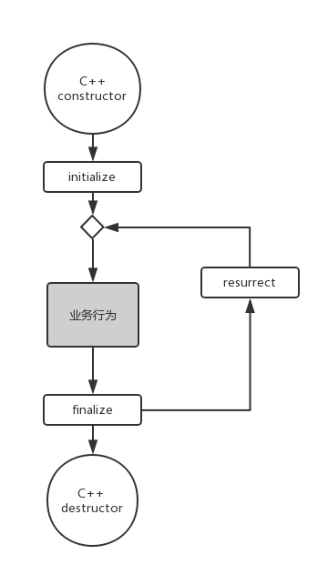

# 内存管理

内存管理时基础中的基础，所有代码定义在头文件Common.h中。

## 类型

### 约定
java-cpp将类型却分为值类型和引用类型，除了关键字和标准库定义的类型外，对自定义的类型约定如下：

1. 值类型：往往作为栈变量使用，或作为其他对象内存布局的一部分依附于其上(如果非要在堆中动态分配不可，请使用C++标准的原始指针或智能指针以及相应的内存释放策略，但这一切和java-cpp所特有的内存管理机制毫无关系)。自定义值类型约定使用关键字struct或enum声明。
2. 引用类型：一定在堆中动态分配且使用java-cpp特有的内存管理机制，自定义引用类型约定使用关键字class或宏interface声明。

对于引用类型而言，约定如下（**粗体表示相对Java的不同，容易出错的地方**）
1. 类使用关键字class定义，所有的接口使用宏interface定义。
2. 类必须直接或间接继承于com_lanjing_cpp_common::Object类，**即便在业务上无基类，也要显示地写出对Object的继承关系**。
3. 接口必须直接或间接继承于com_lanjing_cpp_common::Interface接口，**即便在业务上无基接口，也要显示地写出对Interface的继承关系**。不得具备数据成员，其成员必须为公有的虚函数或静态函数（如果某个虚函数不是纯虚的，则理解为java8的default 方法）。
4. 类继承其基类使用extends宏, 且先于implements出现；**无论当前类型是类还是用接口，接口继承均使用implements宏，且继承多少个接口implements宏就要出现多少次**。

简例如下

    // 1. 即便并无显式的基接口，接口的定义也不可省略"implements Interface"
    // 2. 即便被定义的是接口而非类，也使用implements宏而非extends宏
    interface MyInterface : implements com_lanjing_cpp_common::Interface {
    };
    interface MyInterface2 : implements MyInterface {
    };
    // 即便并无显式的基类，类的定义也不可省略"extends Object"
    class MyClass : extends com_lanjing_cpp_common::Object, implements MyInterface {
    };
    // 无论被声明的是类还是接口，继承多少个接口implements宏就要出现多少次
    class MyClass2 : extends MySuperClass, implements MyInterface, implements MyInterface2 {
    };
实际上，extends宏被替换为public，表示公有继承；而implements宏被替换为virtual public，表示虚拟公有继承。

比较有意思的时，Auxiliary.h定义了一个辅助结构体Nullable&lt;T&gt;（源自.NET2.0），它企图为值类型补充可空逻辑, 让值类型在一定程度上看起来像引用类型（比如可以赋nullptr，可以和nullptr比较）。无论是它企图包装的内容，还是它本身，都是值类型，只是像引用类型而已。

## 引用
提供Ref&lt;T&gt;类型表示强引用。对于某个引用类型T，请永远不要使用原始指针类型T*，而要使用引用类型Ref&lt;T&gt;。

java-cpp使用引用计数管理内存。顶级基类Object提供了retain和release这两个方法操作引用计数；顶级基接口Interface也声明了这两个方法。如果某个类实现了接口，需要类声明中加上interface_refcount()宏命令以快捷地实现接口中的这两个方法。除此之外，用户无需察觉这两个方法存在，因为它们均被Ref&lt;T&gt;自动调用。

*不难看出，java-cpp同COM/Objective-C/swift一样，靠统一的顶级基类型的侵入为对象本身来加入引用计数的机制；并没有采取C++标准库的std::shared_ptr这种非侵入的引用计数。其最重要的原因之一是因为std::shared_ptr让智能指针和原始指针不再兼容，导致将this关键字所代表的对象自我指针逃逸返回到外部时极容易出错，即便小心地正确处理了此细节问题也会导致代码冗长影响简洁性。两权相害取其轻者，最终，java-cpp拒绝使用std::shared_ptr这样的非侵入引用计数，而和COM/Objective-C/swift一样的通过顶级基类型的侵入而让对象本身实现引用计数机制。*

对于继承自Object的类而言，java-cpp通过编译报错的方式强行禁止对其直接使用new关键字以创建对象。对象的创建需要使用以下两种方式之一
1. 如果被调用的构造函数是public的，使用宏new_
2. 如果被调用的构造函数不是public的，使用宏new_internal

二者使用的示范伪码如下

    Ref<MyClass> instance = new_<MyClass>(arg1, arg2, ..., argN);
    Ref<MyClass> instance = new_internal(MyClass, arg1, arg2, ..., argN);

Ref&lt;T&gt;代表强引用，在引用被赋值为nullptr或引用自身超出其作用域时才会自动减少其目标对象的引用计数以放弃目标，此前会一致维系目标对象的生命。当指向某个对象的所有强引用都放弃它时，对象就会死亡。

Ref&lt;T&gt;定义了"operator ->"运算符重载，支持使用"->"符号来使用对象的所有行为，这点和原始指针无异，不再赘述。另外，当Ref&lt;T&gt;的范型参数T为某些特定的类型时，Ref&lt;T&gt;的模板特化版本会提供更多的功能和相关语法糖，即不同类型的引用所能支持的操作是不尽相同的，但是，支持"->"运算符是任何类型的引用都支持的操作，这是最底线的功能。

## 弱引用
java-cpp通过WeakRef&lt;T&gt;来支持弱引用，和保持住目标对象让其不被释放的强引用不同，WeakRef并不阻止其目标对象被释放，但当某个对象被释放时，所有指向该对象的弱引用都会被自动清空，变为nullptr。

WeakRef&lt;T&gt;并不支持"->"运算符来让用户调用对象的行为，所以并不能直接使用弱引用。必须先通过显式的调用get成员函数或隐式的赋值操作将弱引用转变为一个临时的强引用后，再通过这个临时的强引用取操作对象。

## 内存泄露监控 ##

在功能层面引用计数远没有GC那么强大和完美，实际开发中开发人员一旦不慎在多个对象之间构建出闭合的强引用环，就会导致内存泄露*(尽管引用计数算法也衍生出了一些复杂变种来定期发现和解决这类泄露，但终归陷入实时性远不如原始引用计数而强大性远不如GC的尴尬境地)*。有经验的开发人员在使用“引用计数+强弱双引用”技术路线开发应用时，不会表现得GC语言下的开发那么任性和随意，而会小心翼翼地简化数据结构并理清对象之间主次关系，再合理配合强弱两种引用来避免出现强引用环导致泄露，但随着项目需求、内存数据结构复杂度和线程模型的复杂度的逐步提高，即便很有经验且心态非常小心的开发者也可能无意间促成他/她意想不到的强引用环而导致内存泄露，java-cpp打算把这种无心之失报告给开发者。

在开发测试阶段，请在编译环境中积极定义DEBUG宏，此宏会开启java-cpp的内存泄露监控功能。监控功能如下：
1. 如果程序并未内存泄露，程序退出时打印“All the objects are deleted”。
2. 如果程序并发生内存泄露，程序退出打印对象泄露总个数以及每一种类型的对象的泄露数。知道泄露对象的所属的类型对于查找泄露原因是非常有帮助的。

**注意：内存泄露监控有一定的性能开销，在发布到生产环境时请使用取消DEBUG宏定义后重新编译的版本。**

## 对象生命周期和对象复活

在传统C/C++开发中，构造和析构控制对象的生和死，而在C++构造和析构内部调用当前对象自身的虚函数并不会呈现出多态性，和以Java为代表的绝大部分更现代的语言相比，这点在实际开发中很可能造成不便。

为了解决此问题，java-cpp在Object基类中提供了三个保护级的虚函数，它们会被框架自动执行，在自己的类中覆盖它们即可，无需关心它们时怎么被调用的：

    pretected:
        virtual void initialize();
        virtual void resurrect();
        virtual void finalize();
        
- initialize函数在当前类及所有派生类均构造之后自动执行，因此用户可以在自己的类中通过覆盖此函数以达到替换构造函数的目的；由于绕开了C++的vtable动态调整过程，其内部可以调用到this对象的虚函数的正确版本。
- resurrect函数和对象复活有关，稍后讨论。
finalize函数在当前类及所有派生类均析构之前自动执行，因此用户可以在自己的类中通过覆盖此函数以达到替换析构函数的目的；由于绕开了C++的vtable动态调整过程，其内部可以调用到this对象的虚函数的正确版本。

接下来，我们讨论一下对于java-cpp的引用类型对象的生命周期和对象复活问题，其生命周期如下图所示：

执行顺序如下

1. 首先，对象的C++构造函数被自动执行。如果在此过程中将this逃逸出去供外部模块使用，那么外部模块得到的是一个没有被intialize的对象。
2. 继承链上所有类型的构造均完成后，对象的initialize函数被自动执行。如果在此过程中将this逃逸出去供外部模块使用，那么外部模块得到的是一个正在被intialize的对象。
3. 接下来，对象进入正常的服务状态，外部模块可以随意调用对象的业务方法，this也可以随便逃逸出去以正常对象的姿态供外部模块使用。
4. 当所有强引用均抛弃当前对象后，finalize被自动执行。如果在此过程中将this逃逸出去供外部模块使用，导致外部模块的强引用再次指向当前这个即将消亡的对象，且外部模块的强引用并不打算在finalize函数返回前放弃这个濒死对象，这种行为是被允许的! 最终会导致当前对象被复活；否则，对象不会复活。
5. 如果在步骤4中对象被复活了，resurrect函数将会被自动调用。然后对象继续服务，等待下次finalize。
6. 如果在步骤4中对象未被复活，C++析构函数被自动自行，对象真正意义上宣告死亡。

在对象复活方面，java-cpp和java有一个区别：

 - Java中，finalize被执行一次，对象仅有一次复活的机会。
 - java-cpp中，finalize有可能被开发者要求执行多次，防止对象因被无限复活而无法回收的责任由开发者肩负，但也因此让开发人员能控制对象复活的次数。

----------
[首页](../) | [下一篇：异常>](./exception.md)
